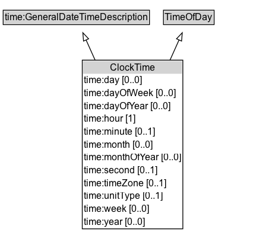

# ClockTime

A description of a time within a single day (hours, minutes, seconds, etc.), recurring daily. Date components (year, month, day) must not be present.

EXAMPLE: 08:30:00 EDT

## Diagram

=== "SVG (interactive)"

    <!-- Generated by graphviz version 14.1.3 (20260303.0454)
     -->
    <!-- Pages: 1 -->
    <svg width="323pt" height="293pt"
     viewBox="0.00 0.00 323.00 293.00" xmlns="http://www.w3.org/2000/svg" xmlns:xlink="http://www.w3.org/1999/xlink">
    <g id="graph0" class="graph" transform="scale(1 1) rotate(0) translate(4 289.25)">
    <polygon fill="white" stroke="none" points="-4,4 -4,-289.25 319.38,-289.25 319.38,4 -4,4"/>
    <g id="clust3" class="cluster">
    <title>cluster_associated</title>
    </g>
    <!-- time_GeneralDateTimeDescription -->
    <g id="node1" class="node">
    <title>time_GeneralDateTimeDescription</title>
    <g id="a_node1"><a xlink:href="https://w3id.org/citydata/imported/time/latest/GeneralDateTimeDescription" xlink:title="&lt;TABLE&gt;">
    <polygon fill="lightgray" stroke="none" points="1,-259.12 1,-275.38 183.75,-275.38 183.75,-259.12 1,-259.12"/>
    <text xml:space="preserve" text-anchor="start" x="2" y="-263.12" font-family="Arial" font-size="12.00">time:GeneralDateTimeDescription</text>
    <polygon fill="none" stroke="black" points="0,-258.12 0,-276.38 184.75,-276.38 184.75,-258.12 0,-258.12"/>
    </a>
    </g>
    </g>
    <!-- TimeOfDay -->
    <g id="node2" class="node">
    <title>TimeOfDay</title>
    <g id="a_node2"><a xlink:href="../TimeOfDay" xlink:title="&lt;TABLE&gt;">
    <polygon fill="lightgray" stroke="none" points="203.38,-259.12 203.38,-275.38 265.38,-275.38 265.38,-259.12 203.38,-259.12"/>
    <text xml:space="preserve" text-anchor="start" x="204.38" y="-263.12" font-family="Arial" font-size="12.00">TimeOfDay</text>
    <polygon fill="none" stroke="black" points="202.38,-258.12 202.38,-276.38 266.38,-276.38 266.38,-258.12 202.38,-258.12"/>
    </a>
    </g>
    </g>
    <!-- ClockTime -->
    <g id="node3" class="node">
    <title>ClockTime</title>
    <g id="a_node3"><a xlink:href="../ClockTime" xlink:title="&lt;TABLE&gt;">
    <polygon fill="lightgray" stroke="none" points="100.88,-196 100.88,-212.25 225.88,-212.25 225.88,-196 100.88,-196"/>
    <text xml:space="preserve" text-anchor="start" x="134.88" y="-200" font-family="Arial" font-size="12.00">ClockTime</text>
    <text xml:space="preserve" text-anchor="start" x="101.88" y="-183.75" font-family="Arial" font-size="12.00">time:day [0..0]</text>
    <text xml:space="preserve" text-anchor="start" x="101.88" y="-167.5" font-family="Arial" font-size="12.00">time:dayOfWeek [0..0]</text>
    <text xml:space="preserve" text-anchor="start" x="101.88" y="-151.25" font-family="Arial" font-size="12.00">time:dayOfYear [0..0]</text>
    <text xml:space="preserve" text-anchor="start" x="101.88" y="-135" font-family="Arial" font-size="12.00">time:hour [1]</text>
    <text xml:space="preserve" text-anchor="start" x="101.88" y="-118.75" font-family="Arial" font-size="12.00">time:minute [0..1]</text>
    <text xml:space="preserve" text-anchor="start" x="101.88" y="-102.5" font-family="Arial" font-size="12.00">time:month [0..0]</text>
    <text xml:space="preserve" text-anchor="start" x="101.88" y="-86.25" font-family="Arial" font-size="12.00">time:monthOfYear [0..0]</text>
    <text xml:space="preserve" text-anchor="start" x="101.88" y="-70" font-family="Arial" font-size="12.00">time:second [0..1]</text>
    <text xml:space="preserve" text-anchor="start" x="101.88" y="-53.75" font-family="Arial" font-size="12.00">time:timeZone [0..1]</text>
    <text xml:space="preserve" text-anchor="start" x="101.88" y="-37.5" font-family="Arial" font-size="12.00">time:unitType [0..1]</text>
    <text xml:space="preserve" text-anchor="start" x="101.88" y="-21.25" font-family="Arial" font-size="12.00">time:week [0..0]</text>
    <text xml:space="preserve" text-anchor="start" x="101.88" y="-5" font-family="Arial" font-size="12.00">time:year [0..0]</text>
    <polygon fill="none" stroke="black" points="99.88,0 99.88,-213.25 226.88,-213.25 226.88,0 99.88,0"/>
    </a>
    </g>
    </g>
    <!-- ClockTime&#45;&gt;time_GeneralDateTimeDescription -->
    <g id="edge1" class="edge">
    <title>ClockTime&#45;&gt;time_GeneralDateTimeDescription</title>
    <path fill="none" stroke="black" d="M116.18,-213.06C111.98,-222.44 108.03,-231.27 104.6,-238.94"/>
    <polygon fill="none" stroke="black" points="101.48,-237.34 100.59,-247.89 107.87,-240.2 101.48,-237.34"/>
    </g>
    <!-- ClockTime&#45;&gt;TimeOfDay -->
    <g id="edge2" class="edge">
    <title>ClockTime&#45;&gt;TimeOfDay</title>
    <path fill="none" stroke="black" d="M210.57,-213.06C214.77,-222.44 218.72,-231.27 222.15,-238.94"/>
    <polygon fill="none" stroke="black" points="218.88,-240.2 226.16,-247.89 225.27,-237.34 218.88,-240.2"/>
    </g>
    <!-- Invis -->
    </g>
    </svg>

=== "PNG"

    

## Formalization for ClockTime

| Property | Constraint |
|----------|------------|
| [time:day](https://w3id.org/citydata/imported/time/day) | max 0 |
| [time:dayOfWeek](https://w3id.org/citydata/imported/time/dayOfWeek) | max 0 |
| [time:dayOfYear](https://w3id.org/citydata/imported/time/dayOfYear) | max 0 |
| [time:hour](https://w3id.org/citydata/imported/time/hour) | exactly 1 |
| [time:minute](https://w3id.org/citydata/imported/time/minute) | max 1 |
| [time:month](https://w3id.org/citydata/imported/time/month) | max 0 |
| [time:monthOfYear](https://w3id.org/citydata/imported/time/monthOfYear) | max 0 |
| [time:second](https://w3id.org/citydata/imported/time/second) | max 1 |
| [time:timeZone](https://w3id.org/citydata/imported/time/timeZone) | max 1 |
| [time:unitType](https://w3id.org/citydata/imported/time/unitType) | some [time:UnitOfTime](https://w3id.org/citydata/imported/time/UnitOfTime) |
| [time:unitType](https://w3id.org/citydata/imported/time/unitType) | max 1 |
| [time:week](https://w3id.org/citydata/imported/time/week) | max 0 |
| [time:year](https://w3id.org/citydata/imported/time/year) | max 0 |
| subClassOf | [TimeOfDay](../TimeOfDay/) |
| subClassOf | [time:GeneralDateTimeDescription](https://w3id.org/citydata/imported/time/GeneralDateTimeDescription) |

## Other annotations

| Property | Value |
|----------|-------|
| [its-core:reqviewId](https://w3id.org/itsdata/core/v1/reqviewId) | its-time-7 |

