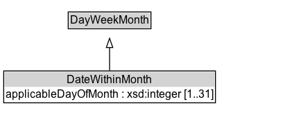

# DateWithinMonth

Recurring periods by the nth day in a month.

## Diagram

=== "SVG (interactive)"

    <!-- Generated by graphviz version 14.1.3 (20260303.0454)
     -->
    <!-- Pages: 1 -->
    <svg width="326pt" height="132pt"
     viewBox="0.00 0.00 326.00 132.00" xmlns="http://www.w3.org/2000/svg" xmlns:xlink="http://www.w3.org/1999/xlink">
    <g id="graph0" class="graph" transform="scale(1 1) rotate(0) translate(4 128)">
    <polygon fill="white" stroke="none" points="-4,4 -4,-128 321.5,-128 321.5,4 -4,4"/>
    <g id="clust3" class="cluster">
    <title>cluster_associated</title>
    </g>
    <!-- DayWeekMonth -->
    <g id="node1" class="node">
    <title>DayWeekMonth</title>
    <g id="a_node1"><a xlink:href="../DayWeekMonth" xlink:title="&lt;TABLE&gt;">
    <polygon fill="lightgray" stroke="none" points="70.75,-97.88 70.75,-114.12 158.25,-114.12 158.25,-97.88 70.75,-97.88"/>
    <text xml:space="preserve" text-anchor="start" x="71.75" y="-101.88" font-family="Arial" font-size="12.00">DayWeekMonth</text>
    <polygon fill="none" stroke="black" points="69.75,-96.88 69.75,-115.12 159.25,-115.12 159.25,-96.88 69.75,-96.88"/>
    </a>
    </g>
    </g>
    <!-- DateWithinMonth -->
    <g id="node2" class="node">
    <title>DateWithinMonth</title>
    <g id="a_node2"><a xlink:href="../DateWithinMonth" xlink:title="&lt;TABLE&gt;">
    <polygon fill="lightgray" stroke="none" points="1,-34 1,-50.25 228,-50.25 228,-34 1,-34"/>
    <text xml:space="preserve" text-anchor="start" x="68.38" y="-38" font-family="Arial" font-size="12.00">DateWithinMonth</text>
    <text xml:space="preserve" text-anchor="start" x="2" y="-21.75" font-family="Arial" font-size="12.00">applicableDayOfMonth : xsd:integer [1..31]</text>
    <polygon fill="none" stroke="black" points="0,-16.75 0,-51.25 229,-51.25 229,-16.75 0,-16.75"/>
    </a>
    </g>
    </g>
    <!-- DateWithinMonth&#45;&gt;DayWeekMonth -->
    <g id="edge1" class="edge">
    <title>DateWithinMonth&#45;&gt;DayWeekMonth</title>
    <path fill="none" stroke="black" d="M114.5,-51.79C114.5,-59.25 114.5,-68.24 114.5,-76.69"/>
    <polygon fill="none" stroke="black" points="111,-76.54 114.5,-86.54 118,-76.54 111,-76.54"/>
    </g>
    <!-- Invis -->
    </g>
    </svg>

=== "PNG"

    

## Formalization for DateWithinMonth

| Property | Constraint |
|----------|------------|
| [applicableDayOfMonth](../properties/applicableDayOfMonth/) | min 1 xsd:integer; max 31 xsd:integer |
| subClassOf | [DayWeekMonth](../DayWeekMonth/) |

## Other annotations

| Property | Value |
|----------|-------|
| [its-core:reqviewId](https://w3id.org/itsdata/core/v1/reqviewId) | its-time-15 |

