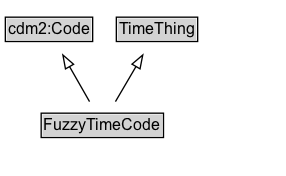

# FuzzyTimeCode

A code indicating a named time during the day, such as `dawn`, `dusk`, `start of rain`, `start of school`, etc.

## Diagram

=== "SVG (interactive)"

    <!-- Generated by graphviz version 14.1.3 (20260303.0454)
     -->
    <!-- Pages: 1 -->
    <svg width="215pt" height="132pt"
     viewBox="0.00 0.00 215.00 132.00" xmlns="http://www.w3.org/2000/svg" xmlns:xlink="http://www.w3.org/1999/xlink">
    <g id="graph0" class="graph" transform="scale(1 1) rotate(0) translate(4 128)">
    <polygon fill="white" stroke="none" points="-4,4 -4,-128 210.75,-128 210.75,4 -4,4"/>
    <g id="clust3" class="cluster">
    <title>cluster_associated</title>
    </g>
    <!-- cdm2_Code -->
    <g id="node1" class="node">
    <title>cdm2_Code</title>
    <g id="a_node1"><a xlink:href="https://w3id.org/citydata/part2/v1/Code" xlink:title="&lt;TABLE&gt;">
    <polygon fill="lightgray" stroke="none" points="1,-97.88 1,-114.12 64.5,-114.12 64.5,-97.88 1,-97.88"/>
    <text xml:space="preserve" text-anchor="start" x="2" y="-101.88" font-family="Arial" font-size="12.00">cdm2:Code</text>
    <polygon fill="none" stroke="black" points="0,-96.88 0,-115.12 65.5,-115.12 65.5,-96.88 0,-96.88"/>
    </a>
    </g>
    </g>
    <!-- TimeThing -->
    <g id="node2" class="node">
    <title>TimeThing</title>
    <g id="a_node2"><a xlink:href="../TimeThing" xlink:title="&lt;TABLE&gt;">
    <polygon fill="lightgray" stroke="none" points="84.25,-97.88 84.25,-114.12 143.25,-114.12 143.25,-97.88 84.25,-97.88"/>
    <text xml:space="preserve" text-anchor="start" x="85.25" y="-101.88" font-family="Arial" font-size="12.00">TimeThing</text>
    <polygon fill="none" stroke="black" points="83.25,-96.88 83.25,-115.12 144.25,-115.12 144.25,-96.88 83.25,-96.88"/>
    </a>
    </g>
    </g>
    <!-- FuzzyTimeCode -->
    <g id="node3" class="node">
    <title>FuzzyTimeCode</title>
    <g id="a_node3"><a xlink:href="../FuzzyTimeCode" xlink:title="&lt;TABLE&gt;">
    <polygon fill="lightgray" stroke="none" points="27.88,-25.88 27.88,-42.12 117.62,-42.12 117.62,-25.88 27.88,-25.88"/>
    <text xml:space="preserve" text-anchor="start" x="28.88" y="-29.88" font-family="Arial" font-size="12.00">FuzzyTimeCode</text>
    <polygon fill="none" stroke="black" points="26.88,-24.88 26.88,-43.12 118.62,-43.12 118.62,-24.88 26.88,-24.88"/>
    </a>
    </g>
    </g>
    <!-- FuzzyTimeCode&#45;&gt;cdm2_Code -->
    <g id="edge1" class="edge">
    <title>FuzzyTimeCode&#45;&gt;cdm2_Code</title>
    <path fill="none" stroke="black" d="M63.16,-51.79C58.65,-59.68 53.16,-69.28 48.1,-78.14"/>
    <polygon fill="none" stroke="black" points="45.11,-76.32 43.18,-86.74 51.18,-79.79 45.11,-76.32"/>
    </g>
    <!-- FuzzyTimeCode&#45;&gt;TimeThing -->
    <g id="edge2" class="edge">
    <title>FuzzyTimeCode&#45;&gt;TimeThing</title>
    <path fill="none" stroke="black" d="M82.58,-51.79C87.2,-59.68 92.83,-69.28 98.02,-78.14"/>
    <polygon fill="none" stroke="black" points="94.99,-79.89 103.06,-86.75 101.03,-76.35 94.99,-79.89"/>
    </g>
    <!-- Invis -->
    </g>
    </svg>

=== "PNG"

    

## Formalization for FuzzyTimeCode

| Property | Constraint |
|----------|------------|
| subClassOf | [TimeThing](../TimeThing/) |
| subClassOf | [cdm2:Code](https://w3id.org/citydata/part2/v1/Code) |

## Other annotations

| Property | Value |
|----------|-------|
| [its-core:reqviewId](https://w3id.org/itsdata/core/v1/reqviewId) | its-time-17 |

