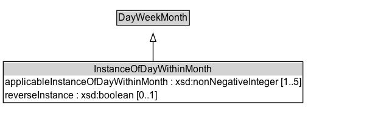

# InstanceOfDayWithinMonth

Recurring periods by the nth occurrence of a weekday in a month.

## Diagram

=== "SVG (interactive)"

    <!-- Generated by graphviz version 14.1.3 (20260303.0454)
     -->
    <!-- Pages: 1 -->
    <svg width="466pt" height="139pt"
     viewBox="0.00 0.00 466.00 139.00" xmlns="http://www.w3.org/2000/svg" xmlns:xlink="http://www.w3.org/1999/xlink">
    <g id="graph0" class="graph" transform="scale(1 1) rotate(0) translate(4 135.38)">
    <polygon fill="white" stroke="none" points="-4,4 -4,-135.38 461.62,-135.38 461.62,4 -4,4"/>
    <g id="clust3" class="cluster">
    <title>cluster_associated</title>
    </g>
    <!-- DayWeekMonth -->
    <g id="node1" class="node">
    <title>DayWeekMonth</title>
    <g id="a_node1"><a xlink:href="../DayWeekMonth" xlink:title="&lt;TABLE&gt;">
    <polygon fill="lightgray" stroke="none" points="140.88,-105.25 140.88,-121.5 228.38,-121.5 228.38,-105.25 140.88,-105.25"/>
    <text xml:space="preserve" text-anchor="start" x="141.88" y="-109.25" font-family="Arial" font-size="12.00">DayWeekMonth</text>
    <polygon fill="none" stroke="black" points="139.88,-104.25 139.88,-122.5 229.38,-122.5 229.38,-104.25 139.88,-104.25"/>
    </a>
    </g>
    </g>
    <!-- InstanceOfDayWithinMonth -->
    <g id="node2" class="node">
    <title>InstanceOfDayWithinMonth</title>
    <g id="a_node2"><a xlink:href="../InstanceOfDayWithinMonth" xlink:title="&lt;TABLE&gt;">
    <polygon fill="lightgray" stroke="none" points="1,-42.12 1,-58.38 368.25,-58.38 368.25,-42.12 1,-42.12"/>
    <text xml:space="preserve" text-anchor="start" x="111.88" y="-46.12" font-family="Arial" font-size="12.00">InstanceOfDayWithinMonth</text>
    <text xml:space="preserve" text-anchor="start" x="2" y="-29.88" font-family="Arial" font-size="12.00">applicableInstanceOfDayWithinMonth : xsd:nonNegativeInteger [1..5]</text>
    <text xml:space="preserve" text-anchor="start" x="2" y="-13.62" font-family="Arial" font-size="12.00">reverseInstance : xsd:boolean [0..1]</text>
    <polygon fill="none" stroke="black" points="0,-8.62 0,-59.38 369.25,-59.38 369.25,-8.62 0,-8.62"/>
    </a>
    </g>
    </g>
    <!-- InstanceOfDayWithinMonth&#45;&gt;DayWeekMonth -->
    <g id="edge1" class="edge">
    <title>InstanceOfDayWithinMonth&#45;&gt;DayWeekMonth</title>
    <path fill="none" stroke="black" d="M184.62,-59.1C184.62,-67.05 184.62,-75.97 184.62,-84.21"/>
    <polygon fill="none" stroke="black" points="181.13,-84.07 184.63,-94.07 188.13,-84.07 181.13,-84.07"/>
    </g>
    <!-- Invis -->
    </g>
    </svg>

=== "PNG"

    

## Formalization for InstanceOfDayWithinMonth

| Property | Constraint |
|----------|------------|
| [applicableInstanceOfDayWithinMonth](../properties/applicableInstanceOfDayWithinMonth/) | min 1 xsd:nonNegativeInteger; max 5 xsd:nonNegativeInteger |
| [reverseInstance](../properties/reverseInstance/) | max 1 xsd:boolean |
| subClassOf | [DayWeekMonth](../DayWeekMonth/) |

## Other annotations

| Property | Value |
|----------|-------|
| [its-core:reqviewId](https://w3id.org/itsdata/core/v1/reqviewId) | its-time-4 |

