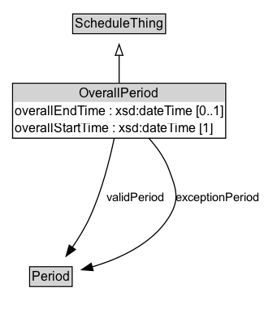

# OverallPeriod

The bounding start and end times of the validity period.

## Diagram

=== "SVG (interactive)"

    <!-- Generated by graphviz version 14.1.3 (20260303.0454)
     -->
    <!-- Pages: 1 -->
    <svg width="244pt" height="294pt"
     viewBox="0.00 0.00 244.00 294.00" xmlns="http://www.w3.org/2000/svg" xmlns:xlink="http://www.w3.org/1999/xlink">
    <g id="graph0" class="graph" transform="scale(1 1) rotate(0) translate(4 289.75)">
    <polygon fill="white" stroke="none" points="-4,4 -4,-289.75 239.74,-289.75 239.74,4 -4,4"/>
    <g id="clust3" class="cluster">
    <title>cluster_associated</title>
    </g>
    <!-- ScheduleThing -->
    <g id="node1" class="node">
    <title>ScheduleThing</title>
    <g id="a_node1"><a xlink:href="../ScheduleThing" xlink:title="&lt;TABLE&gt;">
    <polygon fill="lightgray" stroke="none" points="64.12,-259.62 64.12,-275.88 147.88,-275.88 147.88,-259.62 64.12,-259.62"/>
    <text xml:space="preserve" text-anchor="start" x="65.12" y="-263.62" font-family="Arial" font-size="12.00">ScheduleThing</text>
    <polygon fill="none" stroke="black" points="63.12,-258.62 63.12,-276.88 148.88,-276.88 148.88,-258.62 63.12,-258.62"/>
    </a>
    </g>
    </g>
    <!-- OverallPeriod -->
    <g id="node2" class="node">
    <title>OverallPeriod</title>
    <g id="a_node2"><a xlink:href="../OverallPeriod" xlink:title="&lt;TABLE&gt;">
    <polygon fill="lightgray" stroke="none" points="8.62,-195.5 8.62,-211.75 203.38,-211.75 203.38,-195.5 8.62,-195.5"/>
    <text xml:space="preserve" text-anchor="start" x="69.25" y="-199.5" font-family="Arial" font-size="12.00">OverallPeriod</text>
    <text xml:space="preserve" text-anchor="start" x="9.62" y="-183.25" font-family="Arial" font-size="12.00">overallEndTime : xsd:dateTime [0..1]</text>
    <text xml:space="preserve" text-anchor="start" x="9.62" y="-167" font-family="Arial" font-size="12.00">overallStartTime : xsd:dateTime [1]</text>
    <polygon fill="none" stroke="black" points="7.62,-162 7.62,-212.75 204.38,-212.75 204.38,-162 7.62,-162"/>
    </a>
    </g>
    </g>
    <!-- OverallPeriod&#45;&gt;ScheduleThing -->
    <g id="edge1" class="edge">
    <title>OverallPeriod&#45;&gt;ScheduleThing</title>
    <path fill="none" stroke="black" d="M106,-212.71C106,-220.97 106,-230.27 106,-238.79"/>
    <polygon fill="none" stroke="black" points="102.5,-238.62 106,-248.62 109.5,-238.62 102.5,-238.62"/>
    </g>
    <!-- Invis -->
    <!-- OverallPeriod&#45;&gt;Invis -->
    <!-- Period -->
    <g id="node4" class="node">
    <title>Period</title>
    <g id="a_node4"><a xlink:href="../Period" xlink:title="&lt;TABLE&gt;">
    <polygon fill="lightgray" stroke="none" points="24.38,-25.88 24.38,-42.12 61.62,-42.12 61.62,-25.88 24.38,-25.88"/>
    <text xml:space="preserve" text-anchor="start" x="25.38" y="-29.88" font-family="Arial" font-size="12.00">Period</text>
    <polygon fill="none" stroke="black" points="23.38,-24.88 23.38,-43.12 62.62,-43.12 62.62,-24.88 23.38,-24.88"/>
    </a>
    </g>
    </g>
    <!-- OverallPeriod&#45;&gt;Period -->
    <g id="edge4" class="edge">
    <title>OverallPeriod&#45;&gt;Period</title>
    <path fill="none" stroke="black" d="M101.49,-162.02C97.24,-141.86 89.88,-112.77 79,-89 74.57,-79.32 68.51,-69.44 62.62,-60.81"/>
    <polygon fill="black" stroke="black" points="65.67,-59.05 57.02,-52.92 59.96,-63.1 65.67,-59.05"/>
    <text xml:space="preserve" text-anchor="middle" x="120.93" y="-103.3" font-family="Arial" font-size="11.00">validPeriod</text>
    </g>
    <!-- OverallPeriod&#45;&gt;Period -->
    <g id="edge5" class="edge">
    <title>OverallPeriod&#45;&gt;Period</title>
    <path fill="none" stroke="black" d="M133.14,-162.25C140.73,-153.84 148,-143.78 152,-133 158.81,-114.67 162.31,-105.62 152,-89 136.55,-64.1 105.83,-50.33 80.93,-42.94"/>
    <polygon fill="black" stroke="black" points="82,-39.6 71.43,-40.37 80.17,-46.36 82,-39.6"/>
    <text xml:space="preserve" text-anchor="middle" x="197.11" y="-103.3" font-family="Arial" font-size="11.00">exceptionPeriod</text>
    </g>
    <!-- Invis&#45;&gt;Period -->
    </g>
    </svg>

=== "PNG"

    

## Formalization for OverallPeriod

| Property | Constraint |
|----------|------------|
| [exceptionPeriod](../properties/exceptionPeriod/) | only [Period](https://w3id.org/itsdata/time/v1/Period) |
| [overallEndTime](../properties/overallEndTime/) | max 1 xsd:dateTime |
| [overallStartTime](../properties/overallStartTime/) | exactly 1 xsd:dateTime |
| [validPeriod](../properties/validPeriod/) | only [Period](https://w3id.org/itsdata/time/v1/Period) |
| subClassOf | [ScheduleThing](../ScheduleThing/) |

## Other annotations

| Property | Value |
|----------|-------|
| [its-core:reqviewId](https://w3id.org/itsdata/core/v1/reqviewId) | its-time-16 |

