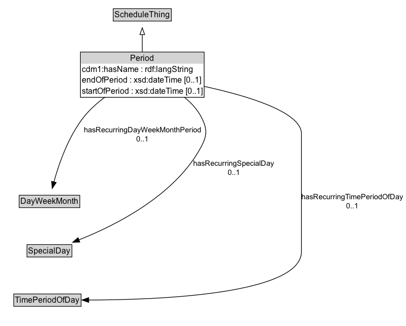

# Period

A single valid or invalid period, or a set of repeating periods.

## Diagram

=== "SVG (interactive)"

    <!-- Generated by graphviz version 14.1.3 (20260303.0454)
     -->
    <!-- Pages: 1 -->
    <svg width="599pt" height="482pt"
     viewBox="0.00 0.00 599.00 482.00" xmlns="http://www.w3.org/2000/svg" xmlns:xlink="http://www.w3.org/1999/xlink">
    <g id="graph0" class="graph" transform="scale(1 1) rotate(0) translate(4 478)">
    <polygon fill="white" stroke="none" points="-4,4 -4,-478 595,-478 595,4 -4,4"/>
    <g id="clust3" class="cluster">
    <title>cluster_associated</title>
    </g>
    <!-- ScheduleThing -->
    <g id="node1" class="node">
    <title>ScheduleThing</title>
    <g id="a_node1"><a xlink:href="../ScheduleThing" xlink:title="&lt;TABLE&gt;">
    <polygon fill="lightgray" stroke="none" points="164.12,-447.88 164.12,-464.12 247.88,-464.12 247.88,-447.88 164.12,-447.88"/>
    <text xml:space="preserve" text-anchor="start" x="165.12" y="-451.88" font-family="Arial" font-size="12.00">ScheduleThing</text>
    <polygon fill="none" stroke="black" points="163.12,-446.88 163.12,-465.12 248.88,-465.12 248.88,-446.88 163.12,-446.88"/>
    </a>
    </g>
    </g>
    <!-- Period -->
    <g id="node2" class="node">
    <title>Period</title>
    <g id="a_node2"><a xlink:href="../Period" xlink:title="&lt;TABLE&gt;">
    <polygon fill="lightgray" stroke="none" points="115.75,-383.75 115.75,-400 296.25,-400 296.25,-383.75 115.75,-383.75"/>
    <text xml:space="preserve" text-anchor="start" x="188.38" y="-387.75" font-family="Arial" font-size="12.00">Period</text>
    <text xml:space="preserve" text-anchor="start" x="116.75" y="-371.5" font-family="Arial" font-size="12.00">cdm1:hasName : rdf:langString</text>
    <text xml:space="preserve" text-anchor="start" x="116.75" y="-355.25" font-family="Arial" font-size="12.00">endOfPeriod : xsd:dateTime [0..1]</text>
    <text xml:space="preserve" text-anchor="start" x="116.75" y="-339" font-family="Arial" font-size="12.00">startOfPeriod : xsd:dateTime [0..1]</text>
    <polygon fill="none" stroke="black" points="114.75,-334 114.75,-401 297.25,-401 297.25,-334 114.75,-334"/>
    </a>
    </g>
    </g>
    <!-- Period&#45;&gt;ScheduleThing -->
    <g id="edge1" class="edge">
    <title>Period&#45;&gt;ScheduleThing</title>
    <path fill="none" stroke="black" d="M206,-400.89C206,-409.45 206,-418.62 206,-426.93"/>
    <polygon fill="none" stroke="black" points="202.5,-426.81 206,-436.81 209.5,-426.81 202.5,-426.81"/>
    </g>
    <!-- Invis -->
    <!-- Period&#45;&gt;Invis -->
    <!-- DayWeekMonth -->
    <g id="node4" class="node">
    <title>DayWeekMonth</title>
    <g id="a_node4"><a xlink:href="../DayWeekMonth" xlink:title="&lt;TABLE&gt;">
    <polygon fill="lightgray" stroke="none" points="25.25,-171.88 25.25,-188.12 112.75,-188.12 112.75,-171.88 25.25,-171.88"/>
    <text xml:space="preserve" text-anchor="start" x="26.25" y="-175.88" font-family="Arial" font-size="12.00">DayWeekMonth</text>
    <polygon fill="none" stroke="black" points="24.25,-170.88 24.25,-189.12 113.75,-189.12 113.75,-170.88 24.25,-170.88"/>
    </a>
    </g>
    </g>
    <!-- Period&#45;&gt;DayWeekMonth -->
    <g id="edge6" class="edge">
    <title>Period&#45;&gt;DayWeekMonth</title>
    <path fill="none" stroke="black" d="M150.91,-334.29C139.56,-325.83 128.43,-315.96 119.75,-305 96.85,-276.09 82.85,-235.43 75.51,-208.66"/>
    <polygon fill="black" stroke="black" points="78.96,-208.04 73.06,-199.24 72.19,-209.8 78.96,-208.04"/>
    <text xml:space="preserve" text-anchor="middle" x="206.38" y="-282.05" font-family="Arial" font-size="11.00">hasRecurringDayWeekMonthPeriod</text>
    <text xml:space="preserve" text-anchor="middle" x="206.38" y="-268.55" font-family="Arial" font-size="11.00">0..1</text>
    </g>
    <!-- SpecialDay -->
    <g id="node5" class="node">
    <title>SpecialDay</title>
    <g id="a_node5"><a xlink:href="../SpecialDay" xlink:title="&lt;TABLE&gt;">
    <polygon fill="lightgray" stroke="none" points="36.88,-98.88 36.88,-115.12 101.12,-115.12 101.12,-98.88 36.88,-98.88"/>
    <text xml:space="preserve" text-anchor="start" x="37.88" y="-102.88" font-family="Arial" font-size="12.00">SpecialDay</text>
    <polygon fill="none" stroke="black" points="35.88,-97.88 35.88,-116.12 102.12,-116.12 102.12,-97.88 35.88,-97.88"/>
    </a>
    </g>
    </g>
    <!-- Period&#45;&gt;SpecialDay -->
    <g id="edge7" class="edge">
    <title>Period&#45;&gt;SpecialDay</title>
    <path fill="none" stroke="black" d="M268.05,-334.14C278.11,-326.03 287.13,-316.33 293,-305 301.99,-287.63 302.13,-278.29 293,-261 254.94,-188.92 165.96,-144.37 112.3,-123.07"/>
    <polygon fill="black" stroke="black" points="113.75,-119.88 103.16,-119.54 111.23,-126.41 113.75,-119.88"/>
    <text xml:space="preserve" text-anchor="middle" x="341.03" y="-232.55" font-family="Arial" font-size="11.00">hasRecurringSpecialDay</text>
    <text xml:space="preserve" text-anchor="middle" x="341.03" y="-219.05" font-family="Arial" font-size="11.00">0..1</text>
    </g>
    <!-- TimePeriodOfDay -->
    <g id="node6" class="node">
    <title>TimePeriodOfDay</title>
    <g id="a_node6"><a xlink:href="../TimePeriodOfDay" xlink:title="&lt;TABLE&gt;">
    <polygon fill="lightgray" stroke="none" points="17.38,-25.88 17.38,-42.12 114.62,-42.12 114.62,-25.88 17.38,-25.88"/>
    <text xml:space="preserve" text-anchor="start" x="18.38" y="-29.88" font-family="Arial" font-size="12.00">TimePeriodOfDay</text>
    <polygon fill="none" stroke="black" points="16.38,-24.88 16.38,-43.12 115.62,-43.12 115.62,-24.88 16.38,-24.88"/>
    </a>
    </g>
    </g>
    <!-- Period&#45;&gt;TimePeriodOfDay -->
    <g id="edge8" class="edge">
    <title>Period&#45;&gt;TimePeriodOfDay</title>
    <path fill="none" stroke="black" d="M297.19,-350.26C363.25,-335.81 441,-312.01 441,-280 441,-280 441,-280 441,-106 441,-42.85 233.12,-34.38 126.91,-34.17"/>
    <polygon fill="black" stroke="black" points="126.92,-30.67 116.92,-34.18 126.93,-37.67 126.92,-30.67"/>
    <text xml:space="preserve" text-anchor="middle" x="516" y="-183.05" font-family="Arial" font-size="11.00">hasRecurringTimePeriodOfDay</text>
    <text xml:space="preserve" text-anchor="middle" x="516" y="-169.55" font-family="Arial" font-size="11.00">0..1</text>
    </g>
    <!-- Invis&#45;&gt;DayWeekMonth -->
    <!-- DayWeekMonth&#45;&gt;SpecialDay -->
    <!-- SpecialDay&#45;&gt;TimePeriodOfDay -->
    </g>
    </svg>

=== "PNG"

    

## Formalization for Period

| Property | Constraint |
|----------|------------|
| [cdm1:hasName](https://w3id.org/citydata/part1/v1/hasName) | datatype rdf:langString |
| [endOfPeriod](../properties/endOfPeriod/) | max 1 xsd:dateTime |
| [hasRecurringDayWeekMonthPeriod](../properties/hasRecurringDayWeekMonthPeriod/) | max 1 [DayWeekMonth](https://w3id.org/itsdata/time/v1/DayWeekMonth) |
| [hasRecurringSpecialDay](../properties/hasRecurringSpecialDay/) | max 1 [SpecialDay](https://w3id.org/itsdata/time/v1/SpecialDay) |
| [hasRecurringTimePeriodOfDay](../properties/hasRecurringTimePeriodOfDay/) | max 1 [TimePeriodOfDay](https://w3id.org/itsdata/time/v1/TimePeriodOfDay) |
| [startOfPeriod](../properties/startOfPeriod/) | max 1 xsd:dateTime |
| subClassOf | [ScheduleThing](../ScheduleThing/) |

## Other annotations

| Property | Value |
|----------|-------|
| [its-core:reqviewId](https://w3id.org/itsdata/core/v1/reqviewId) | its-time-11 |

