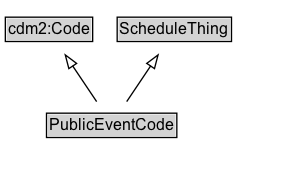

# PublicEventCode

Code that provides for an identification of public event types.

EXAMPLE: airShow, concert, parade

## Diagram

=== "SVG (interactive)"

    <!-- Generated by graphviz version 14.1.3 (20260303.0454)
     -->
    <!-- Pages: 1 -->
    <svg width="225pt" height="132pt"
     viewBox="0.00 0.00 225.00 132.00" xmlns="http://www.w3.org/2000/svg" xmlns:xlink="http://www.w3.org/1999/xlink">
    <g id="graph0" class="graph" transform="scale(1 1) rotate(0) translate(4 128)">
    <polygon fill="white" stroke="none" points="-4,4 -4,-128 220.75,-128 220.75,4 -4,4"/>
    <g id="clust3" class="cluster">
    <title>cluster_associated</title>
    </g>
    <!-- cdm2_Code -->
    <g id="node1" class="node">
    <title>cdm2_Code</title>
    <g id="a_node1"><a xlink:href="https://w3id.org/citydata/part2/v1/Code" xlink:title="&lt;TABLE&gt;">
    <polygon fill="lightgray" stroke="none" points="1,-97.88 1,-114.12 64.5,-114.12 64.5,-97.88 1,-97.88"/>
    <text xml:space="preserve" text-anchor="start" x="2" y="-101.88" font-family="Arial" font-size="12.00">cdm2:Code</text>
    <polygon fill="none" stroke="black" points="0,-96.88 0,-115.12 65.5,-115.12 65.5,-96.88 0,-96.88"/>
    </a>
    </g>
    </g>
    <!-- ScheduleThing -->
    <g id="node2" class="node">
    <title>ScheduleThing</title>
    <g id="a_node2"><a xlink:href="../ScheduleThing" xlink:title="&lt;TABLE&gt;">
    <polygon fill="lightgray" stroke="none" points="84.88,-97.88 84.88,-114.12 168.62,-114.12 168.62,-97.88 84.88,-97.88"/>
    <text xml:space="preserve" text-anchor="start" x="85.88" y="-101.88" font-family="Arial" font-size="12.00">ScheduleThing</text>
    <polygon fill="none" stroke="black" points="83.88,-96.88 83.88,-115.12 169.62,-115.12 169.62,-96.88 83.88,-96.88"/>
    </a>
    </g>
    </g>
    <!-- PublicEventCode -->
    <g id="node3" class="node">
    <title>PublicEventCode</title>
    <g id="a_node3"><a xlink:href="../PublicEventCode" xlink:title="&lt;TABLE&gt;">
    <polygon fill="lightgray" stroke="none" points="31.88,-25.88 31.88,-42.12 127.62,-42.12 127.62,-25.88 31.88,-25.88"/>
    <text xml:space="preserve" text-anchor="start" x="32.88" y="-29.88" font-family="Arial" font-size="12.00">PublicEventCode</text>
    <polygon fill="none" stroke="black" points="30.88,-24.88 30.88,-43.12 128.62,-43.12 128.62,-24.88 30.88,-24.88"/>
    </a>
    </g>
    </g>
    <!-- PublicEventCode&#45;&gt;cdm2_Code -->
    <g id="edge1" class="edge">
    <title>PublicEventCode&#45;&gt;cdm2_Code</title>
    <path fill="none" stroke="black" d="M68.48,-51.79C63.07,-59.85 56.46,-69.69 50.4,-78.71"/>
    <polygon fill="none" stroke="black" points="47.64,-76.55 44.97,-86.8 53.45,-80.45 47.64,-76.55"/>
    </g>
    <!-- PublicEventCode&#45;&gt;ScheduleThing -->
    <g id="edge2" class="edge">
    <title>PublicEventCode&#45;&gt;ScheduleThing</title>
    <path fill="none" stroke="black" d="M91.02,-51.79C96.43,-59.85 103.04,-69.69 109.1,-78.71"/>
    <polygon fill="none" stroke="black" points="106.05,-80.45 114.53,-86.8 111.86,-76.55 106.05,-80.45"/>
    </g>
    <!-- Invis -->
    </g>
    </svg>

=== "PNG"

    

## Formalization for PublicEventCode

| Property | Constraint |
|----------|------------|
| subClassOf | [ScheduleThing](../ScheduleThing/) |
| subClassOf | [cdm2:Code](https://w3id.org/citydata/part2/v1/Code) |

## Other annotations

| Property | Value |
|----------|-------|
| [its-core:reqviewId](https://w3id.org/itsdata/core/v1/reqviewId) | its-time-5 |

