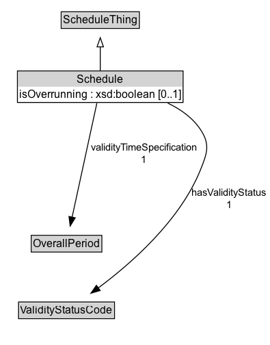

# Schedule

The class defining the temporal validity of a situation element or its impact.

## Diagram

=== "SVG (interactive)"

    <!-- Generated by graphviz version 14.1.3 (20260303.0454)
     -->
    <!-- Pages: 1 -->
    <svg width="296pt" height="378pt"
     viewBox="0.00 0.00 296.00 378.00" xmlns="http://www.w3.org/2000/svg" xmlns:xlink="http://www.w3.org/1999/xlink">
    <g id="graph0" class="graph" transform="scale(1 1) rotate(0) translate(4 374)">
    <polygon fill="white" stroke="none" points="-4,4 -4,-374 292.35,-374 292.35,4 -4,4"/>
    <g id="clust3" class="cluster">
    <title>cluster_associated</title>
    </g>
    <!-- ScheduleThing -->
    <g id="node1" class="node">
    <title>ScheduleThing</title>
    <g id="a_node1"><a xlink:href="../ScheduleThing" xlink:title="&lt;TABLE&gt;">
    <polygon fill="lightgray" stroke="none" points="64.12,-343.88 64.12,-360.12 147.88,-360.12 147.88,-343.88 64.12,-343.88"/>
    <text xml:space="preserve" text-anchor="start" x="65.12" y="-347.88" font-family="Arial" font-size="12.00">ScheduleThing</text>
    <polygon fill="none" stroke="black" points="63.12,-342.88 63.12,-361.12 148.88,-361.12 148.88,-342.88 63.12,-342.88"/>
    </a>
    </g>
    </g>
    <!-- Schedule -->
    <g id="node2" class="node">
    <title>Schedule</title>
    <g id="a_node2"><a xlink:href="../Schedule" xlink:title="&lt;TABLE&gt;">
    <polygon fill="lightgray" stroke="none" points="16.12,-279 16.12,-295.25 195.88,-295.25 195.88,-279 16.12,-279"/>
    <text xml:space="preserve" text-anchor="start" x="80.5" y="-283" font-family="Arial" font-size="12.00">Schedule</text>
    <text xml:space="preserve" text-anchor="start" x="17.12" y="-266.75" font-family="Arial" font-size="12.00">isOverrunning : xsd:boolean [0..1]</text>
    <polygon fill="none" stroke="black" points="15.12,-261.75 15.12,-296.25 196.88,-296.25 196.88,-261.75 15.12,-261.75"/>
    </a>
    </g>
    </g>
    <!-- Schedule&#45;&gt;ScheduleThing -->
    <g id="edge1" class="edge">
    <title>Schedule&#45;&gt;ScheduleThing</title>
    <path fill="none" stroke="black" d="M106,-296.71C106,-304.47 106,-313.92 106,-322.74"/>
    <polygon fill="none" stroke="black" points="102.5,-322.66 106,-332.66 109.5,-322.66 102.5,-322.66"/>
    </g>
    <!-- Invis -->
    <!-- Schedule&#45;&gt;Invis -->
    <!-- OverallPeriod -->
    <g id="node4" class="node">
    <title>OverallPeriod</title>
    <g id="a_node4"><a xlink:href="../OverallPeriod" xlink:title="&lt;TABLE&gt;">
    <polygon fill="lightgray" stroke="none" points="31.25,-98.88 31.25,-115.12 106.75,-115.12 106.75,-98.88 31.25,-98.88"/>
    <text xml:space="preserve" text-anchor="start" x="32.25" y="-102.88" font-family="Arial" font-size="12.00">OverallPeriod</text>
    <polygon fill="none" stroke="black" points="30.25,-97.88 30.25,-116.12 107.75,-116.12 107.75,-97.88 30.25,-97.88"/>
    </a>
    </g>
    </g>
    <!-- Schedule&#45;&gt;OverallPeriod -->
    <g id="edge5" class="edge">
    <title>Schedule&#45;&gt;OverallPeriod</title>
    <path fill="none" stroke="black" d="M102.32,-261.08C95.95,-231.8 82.81,-171.43 75.07,-135.88"/>
    <polygon fill="black" stroke="black" points="78.54,-135.36 72.99,-126.33 71.7,-136.85 78.54,-135.36"/>
    <text xml:space="preserve" text-anchor="middle" x="153.98" y="-209.05" font-family="Arial" font-size="11.00">validityTimeSpecification</text>
    <text xml:space="preserve" text-anchor="middle" x="153.98" y="-195.55" font-family="Arial" font-size="11.00">1</text>
    </g>
    <!-- ValidityStatusCode -->
    <g id="node5" class="node">
    <title>ValidityStatusCode</title>
    <g id="a_node5"><a xlink:href="../ValidityStatusCode" xlink:title="&lt;TABLE&gt;">
    <polygon fill="lightgray" stroke="none" points="17.38,-25.88 17.38,-42.12 120.62,-42.12 120.62,-25.88 17.38,-25.88"/>
    <text xml:space="preserve" text-anchor="start" x="18.38" y="-29.88" font-family="Arial" font-size="12.00">ValidityStatusCode</text>
    <polygon fill="none" stroke="black" points="16.38,-24.88 16.38,-43.12 121.62,-43.12 121.62,-24.88 16.38,-24.88"/>
    </a>
    </g>
    </g>
    <!-- Schedule&#45;&gt;ValidityStatusCode -->
    <g id="edge6" class="edge">
    <title>Schedule&#45;&gt;ValidityStatusCode</title>
    <path fill="none" stroke="black" d="M180.02,-261.05C194.22,-254.35 207.34,-245.01 216,-232 226.84,-215.72 223.3,-206.14 216,-188 193.46,-132.01 139.55,-85.01 103.66,-58.43"/>
    <polygon fill="black" stroke="black" points="105.89,-55.72 95.73,-52.69 101.78,-61.39 105.89,-55.72"/>
    <text xml:space="preserve" text-anchor="middle" x="247.48" y="-159.55" font-family="Arial" font-size="11.00">hasValidityStatus</text>
    <text xml:space="preserve" text-anchor="middle" x="247.48" y="-146.05" font-family="Arial" font-size="11.00">1</text>
    </g>
    <!-- Invis&#45;&gt;OverallPeriod -->
    <!-- OverallPeriod&#45;&gt;ValidityStatusCode -->
    </g>
    </svg>

=== "PNG"

    

## Formalization for Schedule

| Property | Constraint |
|----------|------------|
| [hasValidityStatus](../properties/hasValidityStatus/) | exactly 1 [ValidityStatusCode](https://w3id.org/itsdata/time/v1/ValidityStatusCode) |
| [isOverrunning](../properties/isOverrunning/) | max 1 xsd:boolean |
| [validityTimeSpecification](../properties/validityTimeSpecification/) | exactly 1 [OverallPeriod](https://w3id.org/itsdata/time/v1/OverallPeriod) |
| subClassOf | [ScheduleThing](../ScheduleThing/) |

## Other annotations

| Property | Value |
|----------|-------|
| [its-core:reqviewId](https://w3id.org/itsdata/core/v1/reqviewId) | its-time-12 |

