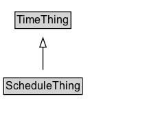

# ScheduleThing

Added for organizational purposes, to identify classes defined in the Schedule Pattern for ITS.

## Diagram

=== "SVG (interactive)"

    <!-- Generated by graphviz version 14.1.3 (20260303.0454)
     -->
    <!-- Pages: 1 -->
    <svg width="182pt" height="132pt"
     viewBox="0.00 0.00 182.00 132.00" xmlns="http://www.w3.org/2000/svg" xmlns:xlink="http://www.w3.org/1999/xlink">
    <g id="graph0" class="graph" transform="scale(1 1) rotate(0) translate(4 128)">
    <polygon fill="white" stroke="none" points="-4,4 -4,-128 177.88,-128 177.88,4 -4,4"/>
    <g id="clust3" class="cluster">
    <title>cluster_associated</title>
    </g>
    <!-- TimeThing -->
    <g id="node1" class="node">
    <title>TimeThing</title>
    <g id="a_node1"><a xlink:href="../TimeThing" xlink:title="&lt;TABLE&gt;">
    <polygon fill="lightgray" stroke="none" points="13.38,-97.88 13.38,-114.12 72.38,-114.12 72.38,-97.88 13.38,-97.88"/>
    <text xml:space="preserve" text-anchor="start" x="14.38" y="-101.88" font-family="Arial" font-size="12.00">TimeThing</text>
    <polygon fill="none" stroke="black" points="12.38,-96.88 12.38,-115.12 73.38,-115.12 73.38,-96.88 12.38,-96.88"/>
    </a>
    </g>
    </g>
    <!-- ScheduleThing -->
    <g id="node2" class="node">
    <title>ScheduleThing</title>
    <g id="a_node2"><a xlink:href="../ScheduleThing" xlink:title="&lt;TABLE&gt;">
    <polygon fill="lightgray" stroke="none" points="1,-25.88 1,-42.12 84.75,-42.12 84.75,-25.88 1,-25.88"/>
    <text xml:space="preserve" text-anchor="start" x="2" y="-29.88" font-family="Arial" font-size="12.00">ScheduleThing</text>
    <polygon fill="none" stroke="black" points="0,-24.88 0,-43.12 85.75,-43.12 85.75,-24.88 0,-24.88"/>
    </a>
    </g>
    </g>
    <!-- ScheduleThing&#45;&gt;TimeThing -->
    <g id="edge1" class="edge">
    <title>ScheduleThing&#45;&gt;TimeThing</title>
    <path fill="none" stroke="black" d="M42.88,-51.79C42.88,-59.25 42.88,-68.24 42.88,-76.69"/>
    <polygon fill="none" stroke="black" points="39.38,-76.54 42.88,-86.54 46.38,-76.54 39.38,-76.54"/>
    </g>
    <!-- Invis -->
    </g>
    </svg>

=== "PNG"

    

## Specializations of ScheduleThing

| Class | Description |
|-------|-------------|
| [Calendar Week Within Month](CalendarWeekWithinMonth.md) | Specification of recurring periods in terms of the calendar week(s) of the month. |
| [Date Within Month](DateWithinMonth.md) | Recurring periods by the nth day in a month. |
| [Day Week Month](DayWeekMonth.md) | Specification of recurring periods based on applicable days of week and months. |
| [Instance Of Day Within Month](InstanceOfDayWithinMonth.md) | Recurring periods by the nth occurrence of a weekday in a month. |
| [Overall Period](OverallPeriod.md) | The bounding start and end times of the validity period. |
| [Period](Period.md) | A single valid or invalid period, or a set of repeating periods. |
| [Public Event Code](PublicEventCode.md) | Code that provides for an identification of public event types. |
| [Public Holiday](PublicHoliday.md) | A specialization representing named public holidays. |
| [Schedule](Schedule.md) | The class defining the temporal validity of a situation element or its impact. |
| [Special Day](SpecialDay.md) | Recurring periods based on special days, including public holidays. |
| [Special Day Type Code](SpecialDayTypeCode.md) | Code that provides for an identification of special day types. |
| [Time Period Of Day](TimePeriodOfDay.md) | Recurring periods within a single day using start and end times. |
| [Validity Status Code](ValidityStatusCode.md) | Code for validity status. |
| [Week Code](WeekCode.md) | Code that provides for a unique identification for weeks within a month. |

## Formalization for ScheduleThing

| Property | Constraint |
|----------|------------|
| subClassOf | [TimeThing](../TimeThing/) |

## Other annotations

| Property | Value |
|----------|-------|
| [its-core:reqviewId](https://w3id.org/itsdata/core/v1/reqviewId) | its-time-9 |

