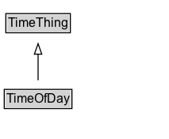

# TimeOfDay

A description of a time within a single day, which can be an explicit time (e.g., 08:30) or a time reference (e.g., `dusk`).

## Diagram

=== "SVG (interactive)"

    <!-- Generated by graphviz version 14.1.3 (20260303.0454)
     -->
    <!-- Pages: 1 -->
    <svg width="160pt" height="132pt"
     viewBox="0.00 0.00 160.00 132.00" xmlns="http://www.w3.org/2000/svg" xmlns:xlink="http://www.w3.org/1999/xlink">
    <g id="graph0" class="graph" transform="scale(1 1) rotate(0) translate(4 128)">
    <polygon fill="white" stroke="none" points="-4,4 -4,-128 156,-128 156,4 -4,4"/>
    <g id="clust3" class="cluster">
    <title>cluster_associated</title>
    </g>
    <!-- TimeThing -->
    <g id="node1" class="node">
    <title>TimeThing</title>
    <g id="a_node1"><a xlink:href="../TimeThing" xlink:title="&lt;TABLE&gt;">
    <polygon fill="lightgray" stroke="none" points="2.5,-97.88 2.5,-114.12 61.5,-114.12 61.5,-97.88 2.5,-97.88"/>
    <text xml:space="preserve" text-anchor="start" x="3.5" y="-101.88" font-family="Arial" font-size="12.00">TimeThing</text>
    <polygon fill="none" stroke="black" points="1.5,-96.88 1.5,-115.12 62.5,-115.12 62.5,-96.88 1.5,-96.88"/>
    </a>
    </g>
    </g>
    <!-- TimeOfDay -->
    <g id="node2" class="node">
    <title>TimeOfDay</title>
    <g id="a_node2"><a xlink:href="../TimeOfDay" xlink:title="&lt;TABLE&gt;">
    <polygon fill="lightgray" stroke="none" points="1,-25.88 1,-42.12 63,-42.12 63,-25.88 1,-25.88"/>
    <text xml:space="preserve" text-anchor="start" x="2" y="-29.88" font-family="Arial" font-size="12.00">TimeOfDay</text>
    <polygon fill="none" stroke="black" points="0,-24.88 0,-43.12 64,-43.12 64,-24.88 0,-24.88"/>
    </a>
    </g>
    </g>
    <!-- TimeOfDay&#45;&gt;TimeThing -->
    <g id="edge1" class="edge">
    <title>TimeOfDay&#45;&gt;TimeThing</title>
    <path fill="none" stroke="black" d="M32,-51.79C32,-59.25 32,-68.24 32,-76.69"/>
    <polygon fill="none" stroke="black" points="28.5,-76.54 32,-86.54 35.5,-76.54 28.5,-76.54"/>
    </g>
    <!-- Invis -->
    </g>
    </svg>

=== "PNG"

    

## Specializations of TimeOfDay

| Class | Description |
|-------|-------------|
| [Clock Time](ClockTime.md) | A description of a time within a single day (hours, minutes, seconds, etc.), recurring daily. Date components (year, month, day) must not be present. |
| [Fuzzy Time](FuzzyTime.md) | An instant in time designated by a named timeReference event (e.g., `dusk`) coupled with a defined offset either before or after the referenced event. The timeReference can be any value from a recognized FuzzyTimeCode. The offset indicates the amount of units of time from this event either before or after the timeReference. |

## Formalization for TimeOfDay

| Property | Constraint |
|----------|------------|
| subClassOf | [TimeThing](../TimeThing/) |

## Other annotations

| Property | Value |
|----------|-------|
| [its-core:reqviewId](https://w3id.org/itsdata/core/v1/reqviewId) | its-time-13 |

