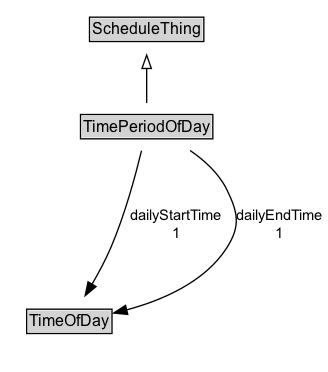

# TimePeriodOfDay

Recurring periods within a single day using start and end times.

## Diagram

=== "SVG (interactive)"

    <!-- Generated by graphviz version 14.1.3 (20260303.0454)
     -->
    <!-- Pages: 1 -->
    <svg width="246pt" height="279pt"
     viewBox="0.00 0.00 246.00 279.00" xmlns="http://www.w3.org/2000/svg" xmlns:xlink="http://www.w3.org/1999/xlink">
    <g id="graph0" class="graph" transform="scale(1 1) rotate(0) translate(4 275)">
    <polygon fill="white" stroke="none" points="-4,4 -4,-275 241.72,-275 241.72,4 -4,4"/>
    <g id="clust3" class="cluster">
    <title>cluster_associated</title>
    </g>
    <!-- ScheduleThing -->
    <g id="node1" class="node">
    <title>ScheduleThing</title>
    <g id="a_node1"><a xlink:href="../ScheduleThing" xlink:title="&lt;TABLE&gt;">
    <polygon fill="lightgray" stroke="none" points="64.12,-244.88 64.12,-261.12 147.88,-261.12 147.88,-244.88 64.12,-244.88"/>
    <text xml:space="preserve" text-anchor="start" x="65.12" y="-248.88" font-family="Arial" font-size="12.00">ScheduleThing</text>
    <polygon fill="none" stroke="black" points="63.12,-243.88 63.12,-262.12 148.88,-262.12 148.88,-243.88 63.12,-243.88"/>
    </a>
    </g>
    </g>
    <!-- TimePeriodOfDay -->
    <g id="node2" class="node">
    <title>TimePeriodOfDay</title>
    <g id="a_node2"><a xlink:href="../TimePeriodOfDay" xlink:title="&lt;TABLE&gt;">
    <polygon fill="lightgray" stroke="none" points="57.38,-171.88 57.38,-188.12 154.62,-188.12 154.62,-171.88 57.38,-171.88"/>
    <text xml:space="preserve" text-anchor="start" x="58.38" y="-175.88" font-family="Arial" font-size="12.00">TimePeriodOfDay</text>
    <polygon fill="none" stroke="black" points="56.38,-170.88 56.38,-189.12 155.62,-189.12 155.62,-170.88 56.38,-170.88"/>
    </a>
    </g>
    </g>
    <!-- TimePeriodOfDay&#45;&gt;ScheduleThing -->
    <g id="edge1" class="edge">
    <title>TimePeriodOfDay&#45;&gt;ScheduleThing</title>
    <path fill="none" stroke="black" d="M106,-197.71C106,-205.47 106,-214.92 106,-223.74"/>
    <polygon fill="none" stroke="black" points="102.5,-223.66 106,-233.66 109.5,-223.66 102.5,-223.66"/>
    </g>
    <!-- Invis -->
    <!-- TimePeriodOfDay&#45;&gt;Invis -->
    <!-- TimeOfDay -->
    <g id="node4" class="node">
    <title>TimeOfDay</title>
    <g id="a_node4"><a xlink:href="../TimeOfDay" xlink:title="&lt;TABLE&gt;">
    <polygon fill="lightgray" stroke="none" points="17,-25.88 17,-42.12 79,-42.12 79,-25.88 17,-25.88"/>
    <text xml:space="preserve" text-anchor="start" x="18" y="-29.88" font-family="Arial" font-size="12.00">TimeOfDay</text>
    <polygon fill="none" stroke="black" points="16,-24.88 16,-43.12 80,-43.12 80,-24.88 16,-24.88"/>
    </a>
    </g>
    </g>
    <!-- TimePeriodOfDay&#45;&gt;TimeOfDay -->
    <g id="edge4" class="edge">
    <title>TimePeriodOfDay&#45;&gt;TimeOfDay</title>
    <path fill="none" stroke="black" d="M102.14,-162.01C97.68,-143.6 89.57,-113.58 79,-89 75.05,-79.82 69.91,-70.23 64.96,-61.73"/>
    <polygon fill="black" stroke="black" points="68.03,-60.05 59.88,-53.28 62.04,-63.66 68.03,-60.05"/>
    <text xml:space="preserve" text-anchor="middle" x="128.25" y="-110.05" font-family="Arial" font-size="11.00">dailyStartTime</text>
    <text xml:space="preserve" text-anchor="middle" x="128.25" y="-96.55" font-family="Arial" font-size="11.00">1</text>
    </g>
    <!-- TimePeriodOfDay&#45;&gt;TimeOfDay -->
    <g id="edge5" class="edge">
    <title>TimePeriodOfDay&#45;&gt;TimeOfDay</title>
    <path fill="none" stroke="black" d="M138.58,-162.12C149.35,-154.75 160.08,-145.01 166,-133 174.65,-115.46 176.57,-105.46 166,-89 149.49,-63.29 117.35,-49.66 90.78,-42.54"/>
    <polygon fill="black" stroke="black" points="91.81,-39.18 81.27,-40.22 90.16,-45.99 91.81,-39.18"/>
    <text xml:space="preserve" text-anchor="middle" x="205.47" y="-110.05" font-family="Arial" font-size="11.00">dailyEndTime</text>
    <text xml:space="preserve" text-anchor="middle" x="205.47" y="-96.55" font-family="Arial" font-size="11.00">1</text>
    </g>
    <!-- Invis&#45;&gt;TimeOfDay -->
    </g>
    </svg>

=== "PNG"

    

## Formalization for TimePeriodOfDay

| Property | Constraint |
|----------|------------|
| [dailyEndTime](../properties/dailyEndTime/) | exactly 1 [TimeOfDay](https://w3id.org/itsdata/time/v1/TimeOfDay) |
| [dailyStartTime](../properties/dailyStartTime/) | exactly 1 [TimeOfDay](https://w3id.org/itsdata/time/v1/TimeOfDay) |
| subClassOf | [ScheduleThing](../ScheduleThing/) |

## Other annotations

| Property | Value |
|----------|-------|
| [its-core:reqviewId](https://w3id.org/itsdata/core/v1/reqviewId) | its-time-10 |

