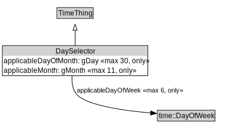

# DaySelector

<a href="../../diagrams/DaySelector.svg">Open interactive DaySelector diagram</a>

## Formalization for DaySelector

| Property | Constraint |
|----------|------------|
| applicableDayOfMonth | max 30 xsd::gDay |
| applicableDayOfMonth | only xsd::gDay |
| applicableDayOfWeek | max 6 time::DayOfWeek |
| applicableDayOfWeek | only time::DayOfWeek |
| applicableMonth | max 11 xsd::gMonth |
| applicableMonth | only xsd::gMonth |
| subClassOf | TimeThing |

## Used by classes

| Class | Property |
|-------|----------|
| [Period](Period.md) | applicableDays |

## Other annotations

| Annotation | Value |
|------------|-------|
| xsd::pattern | TimePattern |

