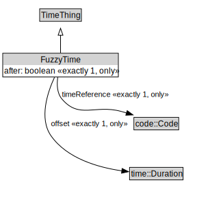

# FuzzyTime

<a href="../../diagrams/FuzzyTime.svg">Open interactive FuzzyTime diagram</a>

## Formalization for FuzzyTime

| Property | Constraint |
|----------|------------|
| after | exactly 1 xsd::boolean |
| after | only xsd::boolean |
| offset | exactly 1 time::Duration |
| offset | only time::Duration |
| subClassOf | TimeThing |
| timeReference | exactly 1 code::Code |
| timeReference | only code::Code |

## Other annotations

| Annotation | Value |
|------------|-------|
| xsd::pattern | TimePattern |

