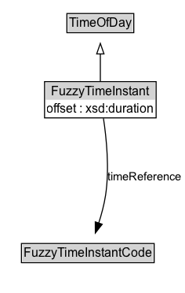

# FuzzyTimeInstant

An instant in time designated by a named timeReference event (e.g., `dusk`) coupled with a defined offset either before or after the referenced event. The timeReference can be any value from a recognized FuzzyTimeInstantCode (from a code list). The offset indicates the amount of units of time from this event either before or after the timeReference.

NOTE:  For named fuzzy *periods* or bands (e.g. seasons, peak hours) used as applicability windows rather than instants, use :FuzzyTimePeriod on :Period via :hasApplicableFuzzyTimePeriod.

EXAMPLE: 30 minutes after dusk

## Diagram

=== "SVG (interactive)"

    <!-- Generated by graphviz version 14.1.3 (20260303.0454)
     -->
    <!-- Pages: 1 -->
    <svg width="177pt" height="279pt"
     viewBox="0.00 0.00 177.00 279.00" xmlns="http://www.w3.org/2000/svg" xmlns:xlink="http://www.w3.org/1999/xlink">
    <g id="graph0" class="graph" transform="scale(1 1) rotate(0) translate(4 275)">
    <polygon fill="white" stroke="none" points="-4,4 -4,-275 173.32,-275 173.32,4 -4,4"/>
    <g id="clust3" class="cluster">
    <title>cluster_associated</title>
    </g>
    <!-- TimeOfDay -->
    <g id="node1" class="node">
    <title>TimeOfDay</title>
    <g id="a_node1"><a xlink:href="../TimeOfDay" xlink:title="&lt;TABLE&gt;">
    <polygon fill="lightgray" stroke="none" points="61,-244.88 61,-261.12 123,-261.12 123,-244.88 61,-244.88"/>
    <text xml:space="preserve" text-anchor="start" x="62" y="-248.88" font-family="Arial" font-size="12.00">TimeOfDay</text>
    <polygon fill="none" stroke="black" points="60,-243.88 60,-262.12 124,-262.12 124,-243.88 60,-243.88"/>
    </a>
    </g>
    </g>
    <!-- FuzzyTimeInstant -->
    <g id="node2" class="node">
    <title>FuzzyTimeInstant</title>
    <g id="a_node2"><a xlink:href="../FuzzyTimeInstant" xlink:title="&lt;TABLE&gt;">
    <polygon fill="lightgray" stroke="none" points="39.62,-180 39.62,-196.25 144.38,-196.25 144.38,-180 39.62,-180"/>
    <text xml:space="preserve" text-anchor="start" x="45.12" y="-184" font-family="Arial" font-size="12.00">FuzzyTimeInstant</text>
    <text xml:space="preserve" text-anchor="start" x="40.62" y="-167.75" font-family="Arial" font-size="12.00">offset : xsd:duration</text>
    <polygon fill="none" stroke="black" points="38.62,-162.75 38.62,-197.25 145.38,-197.25 145.38,-162.75 38.62,-162.75"/>
    </a>
    </g>
    </g>
    <!-- FuzzyTimeInstant&#45;&gt;TimeOfDay -->
    <g id="edge1" class="edge">
    <title>FuzzyTimeInstant&#45;&gt;TimeOfDay</title>
    <path fill="none" stroke="black" d="M92,-197.71C92,-205.47 92,-214.92 92,-223.74"/>
    <polygon fill="none" stroke="black" points="88.5,-223.66 92,-233.66 95.5,-223.66 88.5,-223.66"/>
    </g>
    <!-- Invis -->
    <!-- FuzzyTimeInstant&#45;&gt;Invis -->
    <!-- FuzzyTimeInstantCode -->
    <g id="node4" class="node">
    <title>FuzzyTimeInstantCode</title>
    <g id="a_node4"><a xlink:href="../FuzzyTimeInstantCode" xlink:title="&lt;TABLE&gt;">
    <polygon fill="lightgray" stroke="none" points="17.5,-25.88 17.5,-42.12 142.5,-42.12 142.5,-25.88 17.5,-25.88"/>
    <text xml:space="preserve" text-anchor="start" x="18.5" y="-29.88" font-family="Arial" font-size="12.00">FuzzyTimeInstantCode</text>
    <polygon fill="none" stroke="black" points="16.5,-24.88 16.5,-43.12 143.5,-43.12 143.5,-24.88 16.5,-24.88"/>
    </a>
    </g>
    </g>
    <!-- FuzzyTimeInstant&#45;&gt;FuzzyTimeInstantCode -->
    <g id="edge4" class="edge">
    <title>FuzzyTimeInstant&#45;&gt;FuzzyTimeInstantCode</title>
    <path fill="none" stroke="black" d="M94.98,-162.31C97.75,-144.17 100.9,-114.37 97,-89 95.65,-80.18 93.11,-70.83 90.41,-62.43"/>
    <polygon fill="black" stroke="black" points="93.78,-61.45 87.21,-53.14 87.16,-63.73 93.78,-61.45"/>
    <text xml:space="preserve" text-anchor="middle" x="134.07" y="-103.3" font-family="Arial" font-size="11.00">timeReference</text>
    </g>
    <!-- Invis&#45;&gt;FuzzyTimeInstantCode -->
    </g>
    </svg>

=== "PNG"

    

## Formalization for FuzzyTimeInstant

| Property | Constraint |
|----------|------------|
| [offset](../properties/offset.md) | datatype xsd:duration |
| [timeReference](../properties/timeReference.md) | only [FuzzyTimeInstantCode](https://w3id.org/itsdata/time/v1/FuzzyTimeInstantCode) |
| subClassOf | [TimeOfDay](TimeOfDay.md) |

## Other annotations

| Property | Value |
|----------|-------|
| [its-core:reqviewId](https://w3id.org/itsdata/core/v1/reqviewId) | its-time-1 |

