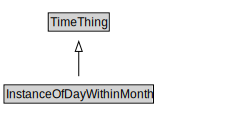

# InstanceOfDayWithinMonth

<a href="../../diagrams/InstanceOfDayWithinMonth.svg">Open interactive InstanceOfDayWithinMonth diagram</a>

## Formalization for InstanceOfDayWithinMonth

| Property | Constraint |
|----------|------------|
| subClassOf | TimeThing |

## Other annotations

| Annotation | Value |
|------------|-------|
| xsd::pattern | TimePattern |

