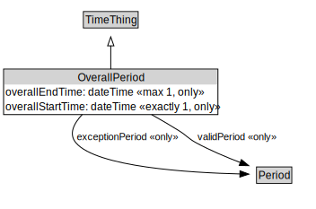

# OverallPeriod

<a href="../../diagrams/OverallPeriod.svg">Open interactive OverallPeriod diagram</a>

## Formalization for OverallPeriod

| Property | Constraint |
|----------|------------|
| exceptionPeriod | only Period |
| overallEndTime | max 1 xsd::dateTime |
| overallEndTime | only xsd::dateTime |
| overallStartTime | exactly 1 xsd::dateTime |
| overallStartTime | only xsd::dateTime |
| subClassOf | TimeThing |
| validPeriod | only Period |

## Used by classes

| Class | Property |
|-------|----------|
| [Validity](Validity.md) | validityTimeSpecification |

## Other annotations

| Annotation | Value |
|------------|-------|
| xsd::pattern | TimePattern |

