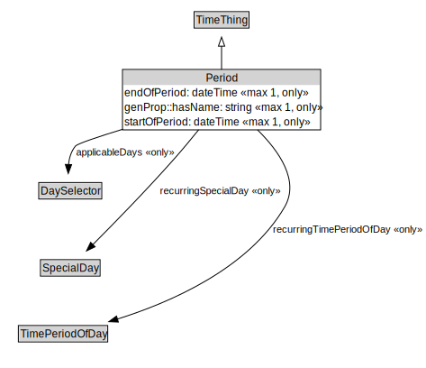

# Period

<a href="../../diagrams/Period.svg">Open interactive Period diagram</a>

## Formalization for Period

| Property | Constraint |
|----------|------------|
| applicableDays | only DaySelector |
| endOfPeriod | max 1 xsd::dateTime |
| endOfPeriod | only xsd::dateTime |
| genProp::hasName | max 1 xsd::string |
| genProp::hasName | only xsd::string |
| recurringSpecialDay | only SpecialDay |
| recurringTimePeriodOfDay | only TimePeriodOfDay |
| startOfPeriod | max 1 xsd::dateTime |
| startOfPeriod | only xsd::dateTime |
| subClassOf | TimeThing |

## Used by classes

| Class | Property |
|-------|----------|
| [Overall Period](OverallPeriod.md) | exceptionPeriod |
| [Overall Period](OverallPeriod.md) | validPeriod |

## Other annotations

| Annotation | Value |
|------------|-------|
| xsd::pattern | TimePattern |

