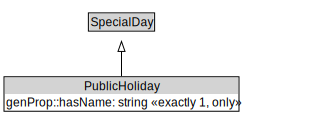

# PublicHoliday

<a href="../../diagrams/PublicHoliday.svg">Open interactive PublicHoliday diagram</a>

## Formalization for PublicHoliday

| Property | Constraint |
|----------|------------|
| genProp::hasName | exactly 1 xsd::string |
| genProp::hasName | only xsd::string |
| subClassOf | SpecialDay |

## Other annotations

| Annotation | Value |
|------------|-------|
| xsd::pattern | TimePattern |

