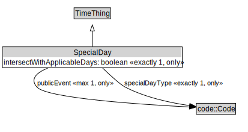

# SpecialDay

<a href="../../diagrams/SpecialDay.svg">Open interactive SpecialDay diagram</a>

## Specializations of SpecialDay

| Class | Description |
|-------|-------------|
| [Public Holiday](PublicHoliday.md) |  |

## Formalization for SpecialDay

| Property | Constraint |
|----------|------------|
| intersectWithApplicableDays | exactly 1 xsd::boolean |
| intersectWithApplicableDays | only xsd::boolean |
| publicEvent | max 1 code::Code |
| publicEvent | only code::Code |
| specialDayType | exactly 1 code::Code |
| specialDayType | only code::Code |
| subClassOf | TimeThing |

## Used by classes

| Class | Property |
|-------|----------|
| [Period](Period.md) | recurringSpecialDay |

## Other annotations

| Annotation | Value |
|------------|-------|
| xsd::pattern | TimePattern |

