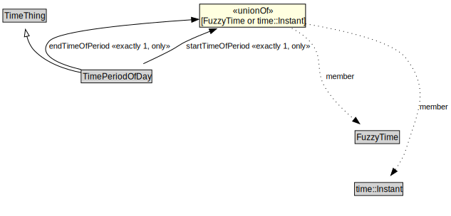

# TimePeriodOfDay

<a href="../../diagrams/TimePeriodOfDay.svg">Open interactive TimePeriodOfDay diagram</a>

## Formalization for TimePeriodOfDay

| Property | Constraint |
|----------|------------|
| endTimeOfPeriod | exactly 1 (FuzzyTime or time::Instant) |
| endTimeOfPeriod | only (FuzzyTime or time::Instant) |
| startTimeOfPeriod | exactly 1 (FuzzyTime or time::Instant) |
| startTimeOfPeriod | only (FuzzyTime or time::Instant) |
| subClassOf | TimeThing |

## Used by classes

| Class | Property |
|-------|----------|
| [Period](Period.md) | recurringTimePeriodOfDay |

## Other annotations

| Annotation | Value |
|------------|-------|
| xsd::pattern | TimePattern |

