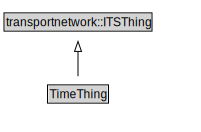

# TimeThing

<a href="../../diagrams/TimeThing.svg">Open interactive TimeThing diagram</a>

## Specializations of TimeThing

| Class | Description |
|-------|-------------|
| [Day Selector](DaySelector.md) |  |
| [Fuzzy Time](FuzzyTime.md) |  |
| [Instance Of Day Within Month](InstanceOfDayWithinMonth.md) |  |
| [Overall Period](OverallPeriod.md) |  |
| [Period](Period.md) |  |
| [Public Holiday](PublicHoliday.md) |  |
| [Special Day](SpecialDay.md) |  |
| [Time Period Of Day](TimePeriodOfDay.md) |  |
| [Validity](Validity.md) |  |

## Formalization for TimeThing

| Property | Constraint |
|----------|------------|
| subClassOf | transportnetwork::ITSThing |

## Other annotations

| Annotation | Value |
|------------|-------|
| xsd::pattern | TimePattern |

