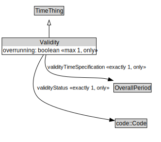

# Validity

<a href="../../diagrams/Validity.svg">Open interactive Validity diagram</a>

## Formalization for Validity

| Property | Constraint |
|----------|------------|
| overrunning | max 1 xsd::boolean |
| overrunning | only xsd::boolean |
| subClassOf | TimeThing |
| validityStatus | exactly 1 code::Code |
| validityStatus | only code::Code |
| validityTimeSpecification | exactly 1 OverallPeriod |
| validityTimeSpecification | only OverallPeriod |

## Other annotations

| Annotation | Value |
|------------|-------|
| xsd::pattern | TimePattern |

