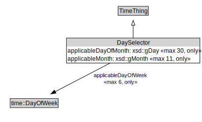

# DaySelector

<a href="../../diagrams/itsTime__DaySelector.dot.svg">Open interactive DaySelector diagram</a>

## Formalization for DaySelector

| Property | Constraint |
|----------|------------|
| applicableDayOfMonth | all xsd::gDay |
| applicableDayOfMonth | max 30 owl::Thing |
| applicableDayOfWeek | all time::DayOfWeek |
| applicableDayOfWeek | max 6 owl::Thing |
| applicableMonth | all xsd::gMonth |
| applicableMonth | max 11 owl::Thing |
| subClassOf | TimeThing |

## Used by classes

| Class | Property |
|-------|----------|
| [Period](itsTime__Period.md) | applicableDays |

## Other annotations

| Annotation | Value |
|------------|-------|
| xsd::pattern | TimePattern |

