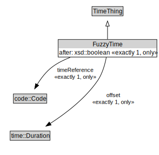

# FuzzyTime

<a href="../../diagrams/itsTime__FuzzyTime.dot.svg">Open interactive FuzzyTime diagram</a>

## Formalization for FuzzyTime

| Property | Constraint |
|----------|------------|
| after | all xsd::boolean |
| after | exactly 1 owl::Thing |
| offset | all time::Duration |
| offset | exactly 1 owl::Thing |
| subClassOf | TimeThing |
| timeReference | all code::Code |
| timeReference | exactly 1 owl::Thing |

## Other annotations

| Annotation | Value |
|------------|-------|
| xsd::pattern | TimePattern |

