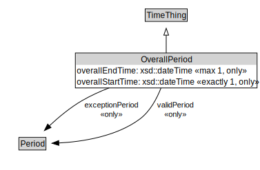

# OverallPeriod

<a href="../../diagrams/itsTime__OverallPeriod.dot.svg">Open interactive OverallPeriod diagram</a>

## Formalization for OverallPeriod

| Property | Constraint |
|----------|------------|
| exceptionPeriod | all Period |
| overallEndTime | all xsd::dateTime |
| overallEndTime | max 1 owl::Thing |
| overallStartTime | all xsd::dateTime |
| overallStartTime | exactly 1 owl::Thing |
| subClassOf | TimeThing |
| validPeriod | all Period |

## Used by classes

| Class | Property |
|-------|----------|
| [Validity](itsTime__Validity.md) | validityTimeSpecification |

## Other annotations

| Annotation | Value |
|------------|-------|
| xsd::pattern | TimePattern |

