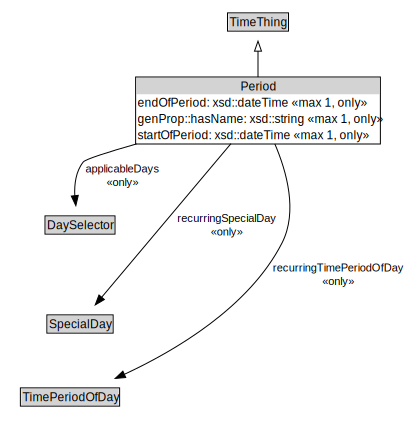

# Period

<a href="../../diagrams/itsTime__Period.dot.svg">Open interactive Period diagram</a>

## Formalization for Period

| Property | Constraint |
|----------|------------|
| applicableDays | all DaySelector |
| endOfPeriod | all xsd::dateTime |
| endOfPeriod | max 1 owl::Thing |
| genProp::hasName | all xsd::string |
| genProp::hasName | max 1 owl::Thing |
| recurringSpecialDay | all SpecialDay |
| recurringTimePeriodOfDay | all TimePeriodOfDay |
| startOfPeriod | all xsd::dateTime |
| startOfPeriod | max 1 owl::Thing |
| subClassOf | TimeThing |

## Used by classes

| Class | Property |
|-------|----------|
| [Overall Period](itsTime__OverallPeriod.md) | exceptionPeriod |
| [Overall Period](itsTime__OverallPeriod.md) | validPeriod |

## Other annotations

| Annotation | Value |
|------------|-------|
| xsd::pattern | TimePattern |

