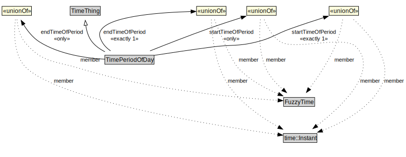

# TimePeriodOfDay

<a href="../../diagrams/itsTime__TimePeriodOfDay.dot.svg">Open interactive TimePeriodOfDay diagram</a>

## Formalization for TimePeriodOfDay

| Property | Constraint |
|----------|------------|
| endTimeOfPeriod | all FuzzyTime or time::Instant |
| endTimeOfPeriod | exactly 1 owl::Thing |
| startTimeOfPeriod | all FuzzyTime or time::Instant |
| startTimeOfPeriod | exactly 1 owl::Thing |
| subClassOf | TimeThing |

## Used by classes

| Class | Property |
|-------|----------|
| [Period](itsTime__Period.md) | recurringTimePeriodOfDay |

## Other annotations

| Annotation | Value |
|------------|-------|
| xsd::pattern | TimePattern |

