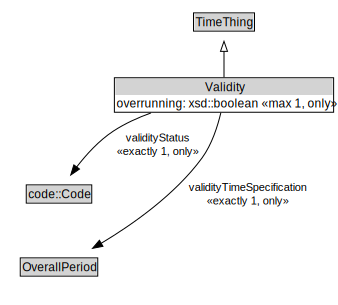

# Validity

<a href="../../diagrams/itsTime__Validity.dot.svg">Open interactive Validity diagram</a>

## Formalization for Validity

| Property | Constraint |
|----------|------------|
| overrunning | all xsd::boolean |
| overrunning | max 1 owl::Thing |
| subClassOf | TimeThing |
| validityStatus | all code::Code |
| validityStatus | exactly 1 owl::Thing |
| validityTimeSpecification | all OverallPeriod |
| validityTimeSpecification | exactly 1 owl::Thing |

## Other annotations

| Annotation | Value |
|------------|-------|
| xsd::pattern | TimePattern |

